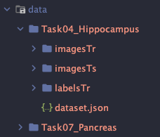
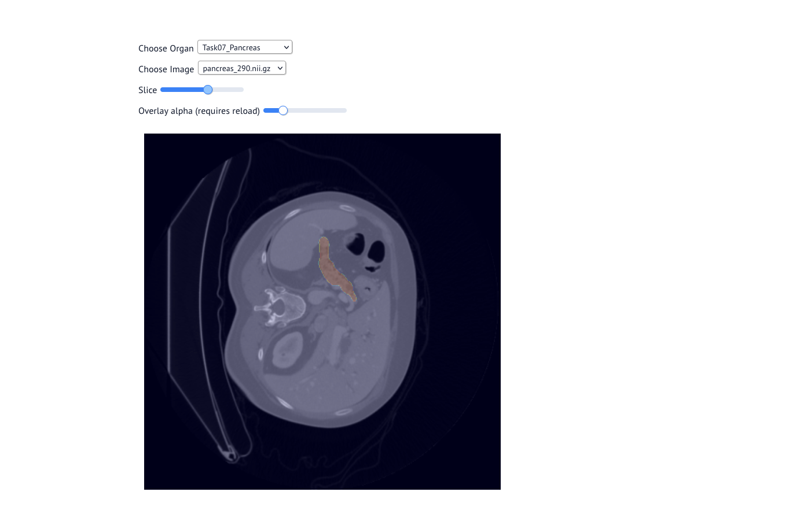

# Interactive Viewer for the Medical Segmentation Decathlon
## [Dataset Link](https://drive.google.com/drive/folders/1HqEgzS8BV2c7xYNrZdEAnrHk7osJJ--2)
## [Paper Link](https://www.nature.com/articles/s41467-022-30695-9)
## Setup
Download dataset so that:
```
data/TaskXX_Organ/images...
```
Example:



Create a new conda environment
```
conda create -n decathlon python=3.10
```

Activate Environment
```
conda activate decathlon
```

Install dependencies
```
pip install -r requirements.txt
```
## Running
Run App
```
marimo run notebook.py
```


Edit Notebook
```
marimo edit notebook.py
```

## [Marimo Documentation](https://docs.marimo.io/)